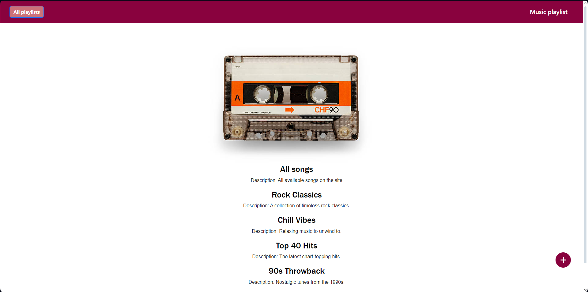
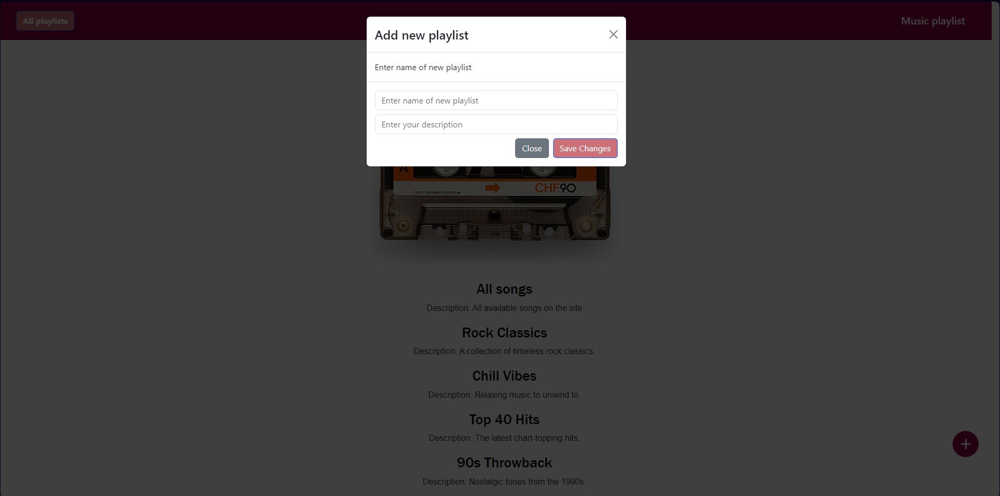
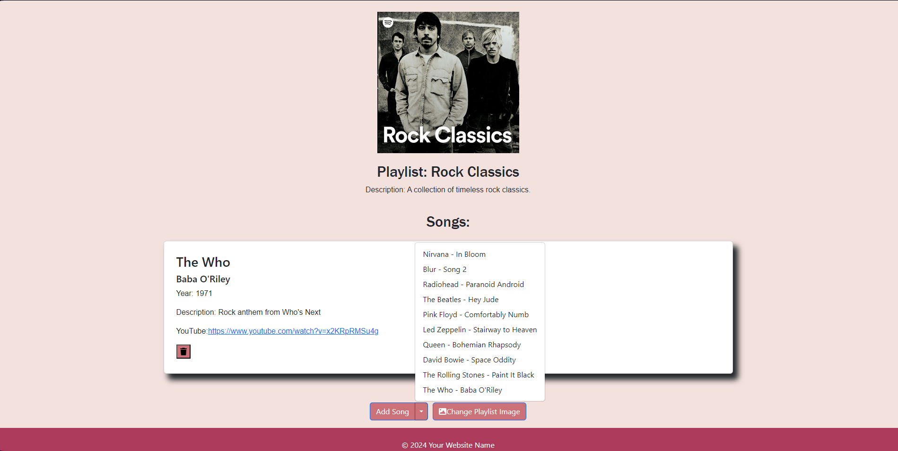

# Music Playlist Creator

## Description
Music Playlist Creator is a web application developed using React that allows users to create and manage their music playlists. It provides an intuitive interface for adding, deleting, and organizing tracks within playlists.

## Key Features
Create and Edit Playlists: Users can easily create new playlists, add and remove tracks, and modify or delete playlist covers.

## Technologies
Frontend: Developed using React, React-router, and Redux.

## Screenshots

*Caption: Main screen of the application.*

*Caption: Creating a new playlist.*

*Caption: Adding a track to a playlist.*

## Getting Started
1. Clone the repository.
2. Install dependencies: npm install.
3. Start the project: npm start.
